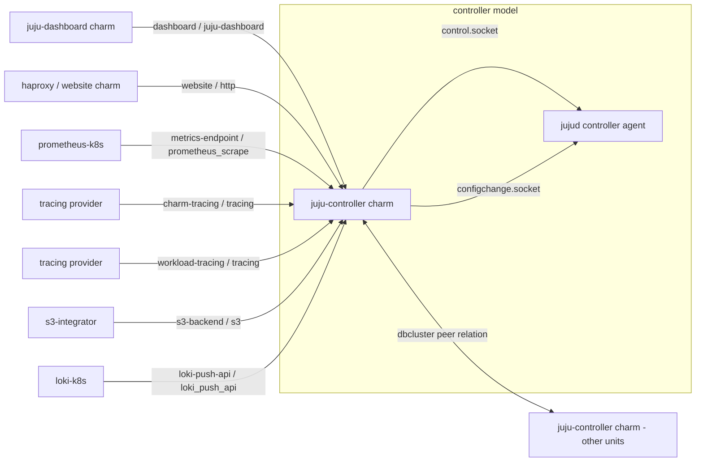

# Juju Controller Charm — Integrations, Configuration, and the Upstream `controllercharm` Test Suite

This document explains how the `juju-controller` charm (this repo) works,
what it integrates with, what configuration it exposes, and what the
upstream `juju/juju` repository's `tests/suites/controllercharm` functional
test suite does.

## 1. What this charm is

The `juju-controller` charm is **not deployed like a normal charm** — it is
the charm that Juju itself installs onto every machine in the special
`controller` model whenever you bootstrap a Juju controller (Juju 3.0+). It
runs alongside the `jujud` controller agent on each controller machine/unit
and exposes controller functionality to the outside world through standard
Juju relations (integrations), config options, and status.

It talks to the local `jujud` controller process through two local Unix
domain sockets rather than a public network API:

- **Control socket** (`/var/lib/juju/control.socket`) — implemented by
  `src/controlsocket.py` (`ControlSocketClient`). Used to push
  charm/workload tracing config, S3 backup credentials, Loki push-API
  endpoint config, and metrics-endpoint Basic Auth users into the running
  controller.
- **Config-change socket** (`/var/lib/juju/configchange.socket`) —
  implemented by `src/configchangesocket.py`
  (`ConfigChangeSocketClient`). Used to fetch the local controller/agent ID
  and to ask `jujud` to reload `controller.conf` after the charm rewrites it
  (e.g. new DB bind addresses).

Both clients build on `src/unixsocket.py`, a small HTTP-over-Unix-socket
client (adapted from `ops.pebble.Client`) that issues JSON or raw HTTP
requests over the socket file.

The charm's own logic lives in `src/charm.py` (`JujuControllerCharm`).

## 2. Relations / integrations

Declared in `charmcraft.yaml`:

### Provides (other charms relate *to* the controller)

| Endpoint | Interface | Purpose |
|---|---|---|
| `dashboard` | `juju-dashboard` | Lets a [`juju-dashboard`](https://charmhub.io/juju-dashboard) charm discover the controller URL, identity-provider URL, and whether this is a "real" Juju controller (vs. e.g. JIMM). |
| `website` | `http` | Generic HTTP endpoint publishing hostname/address/port of the controller API server (historically used by reverse proxies like `haproxy`). |
| `metrics-endpoint` | `prometheus_scrape` | Lets Prometheus (`prometheus-k8s`/`prometheus`) scrape the controller's `/introspection/metrics` endpoint over HTTPS with Basic Auth. |

### Requires (controller relates *out* to other charms)

| Endpoint | Interface | Optional? | Purpose |
|---|---|---|---|
| `charm-tracing` | `tracing` (limit 1) | yes | Sends the *charm's own* traces to an OTLP collector (e.g. Tempo). |
| `charm-tracing-ca-cert` | `certificate_transfer` (limit 1) | yes | CA cert needed if the charm-tracing endpoint is `https://`/`grpcs://`. |
| `workload-tracing` | `tracing` (limit 1) | yes | Sends `jujud` **workload** traces to an OTLP collector. |
| `workload-tracing-ca-cert` | `certificate_transfer` (limit 1) | yes | CA cert for the workload-tracing endpoint. |
| `s3-backend` | `s3` (limit 1) | yes | S3-compatible storage credentials, used for controller backups. |
| `loki-push-api` | `loki_push_api` (limit 1) | yes | Configures `jujud` to push logs to a Loki instance. |
| `loki-push-api-ca-cert` | `certificate_transfer` (limit 1) | yes | CA cert for the Loki endpoint. |

### Peers

| Endpoint | Interface | Purpose |
|---|---|---|
| `dbcluster` | `dbcluster` | Peer relation between controller units used to exchange each unit's Dqlite/DB bind address, so the leader can aggregate them into `db-bind-addresses` and write `controller.conf`. This is what backs Juju's HA (`enable-ha`). |

## 3. Background: the other technologies this charm integrates with

The controller charm mostly acts as a thin adapter: it doesn't implement
any of these technologies itself, it just plumbs Juju relation data into
`jujud`'s local config (via the control/config-change sockets) or into its
own relation data, so that a purpose-built charm on the other end of the
relation can do its job. Here's what each one is and why the controller
needs it.

### Juju Dashboard (`dashboard` / `juju-dashboard` interface)

[`juju-dashboard`](https://charmhub.io/juju-dashboard) is Canonical's
web GUI for Juju — it shows models, applications, units, relations, and
lets you visually inspect/manage a controller instead of using the CLI.
The dashboard is a *separate* charm/webapp; it doesn't know how to reach a
controller's API on its own, so it needs three pieces of information from
the controller: the **controller API URL** (`controller-url`), an optional
**external identity provider URL** (`identity-provider-url`, e.g. Candid,
for SSO-style login flows), and whether this really is a bare Juju
controller (`is-juju`) as opposed to something dashboard-compatible but
different (e.g. JIMM, which aggregates multiple controllers). This is
purely a **charm-config → relation application-databag** pass-through — the
charm code doesn't talk to the dashboard over a socket, it just writes
three strings into `dashboard-relation-joined` app data (see
`_on_dashboard_relation_joined`). The dashboard then reads that data and
uses it to point its frontend at the right controller and login mechanism.
This is why `juju dashboard --browser` "just works" once you `juju
integrate controller juju-dashboard`.

### `website` interface (generic HTTP / reverse proxies e.g. `haproxy`)

The `http` interface here is a generic "here's an HTTP(S) endpoint you can
front" relation. Historically it was used to let something like
[`haproxy`](https://charmhub.io/haproxy) load-balance or reverse-proxy the
controller's API server, or to let other charms discover
"hostname/address/port" of the controller's built-in web server without
hardcoding it. The charm simply reads the real controller API port out of
`agent.conf` (`api_port()`) and its own network binding address, and
publishes `hostname` / `private-address` / `port` into unit relation data
on `website-relation-joined`.

### Tracing: Tempo / OpenTelemetry (`charm-tracing`, `workload-tracing` / `tracing` interface)

This is about **distributed tracing** — capturing spans (timed,
nested operations with metadata) so operators can see where time is spent
and diagnose latency/errors across a distributed system. In the Canonical
observability stack ("COS"), traces are collected by
[**Tempo**](https://charmhub.io/tempo-coordinator-k8s) (via the
`tempo-coordinator-k8s` charm, which fronts Grafana Tempo) using the
industry-standard **OpenTelemetry Protocol (OTLP)**, over either gRPC
(`otlp_grpc`) or HTTP (`otlp_http`).

The controller charm requests tracing via the shared
`charms.tempo_coordinator_k8s.v0.tracing` charm library
(`TracingEndpointRequirer`), which is the standard client for *any* charm
that wants to ship traces to Tempo — it isn't Tempo-specific logic baked
into this charm, it's a reusable interface library. There are **two
independent tracing relations**, because there are two different things
being traced:

- **`charm-tracing`** — traces of the **charm's own Python/`ops` code**
  (the charm hook executions themselves: install, config-changed, relation
  handlers, etc.). Useful for debugging the charm's own operational logic
  (e.g. "why did `metrics-endpoint-relation-created` take 4 seconds?").
- **`workload-tracing`** — traces of the **`jujud` controller workload**
  itself (the actual Juju API server / controller internals), configured
  via the control socket (`set_workload_tracing_config`) with additional
  OpenTelemetry knobs exposed as charm config: `workload-tracing-sample-ratio`
  (fraction of requests traced, to control overhead/volume),
  `workload-tracing-stack-traces` (include Python/Go stack traces in spans),
  `workload-tracing-tail-sampling-threshold` (only keep traces slower than
  this duration once the whole trace is complete — "tail-based sampling"),
  and `workload-tracing-insecure-skip-verify` (skip TLS verification, e.g.
  for self-signed test setups).

Because Tempo's ingestion endpoint is normally TLS-secured, the charm also
needs the **`*-tracing-ca-cert`** relations
(`charms.certificate_transfer_interface`) to receive Tempo's CA certificate
out-of-band, so it can pass it down to `jujud`/its own tracing client for
TLS verification — without this, an `https://`/`grpcs://` tracing endpoint
would be untrusted and the charm blocks with a clear status message rather
than silently failing or disabling TLS.

### S3 (`s3-backend` / `s3` interface)

Juju controllers support **backing up their state** (the Dqlite database
behind the controller) to any S3-compatible object storage. This relation
lets an S3 credentials provider — typically
[`s3-integrator`](https://charmhub.io/s3-integrator) — hand the controller
an access key, secret key, and endpoint URL, via the shared
`charms.data_platform_libs.v0.s3` library (`S3Requirer`), which is the
common S3-credentials interface used across many Canonical/data-platform
charms (Postgres, MySQL, OpenSearch, etc.), not something specific to Juju.
The controller charm forwards those credentials straight to `jujud` via
the control socket (`add_s3_credentials`/`remove_s3_credentials`) so that
Juju's own backup tooling can push/pull backup archives to that bucket.
Credentials are re-applied on leadership change (`leader-elected`) in case
a new leader unit missed the original relation event.

### Loki (`loki-push-api` / `loki_push_api` interface)

[**Loki**](https://charmhub.io/loki-k8s) is Grafana's log-aggregation
system — think "Prometheus, but for logs" — and `loki_push_api` is its
push-based log-ingestion interface. Rather than something scraping logs
from the controller, the controller (via `jujud`) actively **pushes** its
logs to Loki's HTTP push endpoint. The controller charm uses the shared
`charms.loki_k8s.v1.loki_push_api` library (`LokiPushApiConsumer`) —
again, a generic interface used by many log-producing charms, not
Loki-specific charm logic — to discover Loki's push URL from relation data,
and forwards it to `jujud` via the control socket (`set_loki_endpoint`),
along with an optional CA cert (`loki-push-api-ca-cert`, same
certificate-transfer mechanism as tracing), a `loki-org-id` config value
(Loki's multi-tenancy header, needed when a single Loki is shared across
multiple tenants/teams), and `loki-insecure-skip-verify` for skipping TLS
validation. This is what lets controller logs show up centrally in
Grafana/COS dashboards instead of only being visible via `journalctl`/
`juju debug-log` on each machine.

### Prometheus (`metrics-endpoint` / `prometheus_scrape` interface)

[**Prometheus**](https://charmhub.io/prometheus-k8s) is the
metrics-collection half of COS (paired with Loki for logs and Tempo for
traces). Unlike Loki, Prometheus works by **scraping** (pulling) metrics
from a target's HTTP endpoint on an interval, rather than having them
pushed. The controller already exposes a Go-standard
`/introspection/metrics` endpoint with internal `jujud` metrics (API
request counts/latencies, DB stats, etc.). The charm's job is to tell
Prometheus *where* that endpoint is and *how to authenticate to it*: it
generates a random per-relation Basic Auth username/password, registers it
with `jujud` (`add_metrics_user`), and publishes a scrape job (via the
shared `charms.prometheus_k8s.v0.prometheus_scrape` library's
`MetricsEndpointProvider` — again a generic Prometheus-relation library,
not custom to this charm) describing the target address, HTTPS scheme,
Basic Auth credentials, and the controller's CA cert for TLS verification.
This is exactly what the upstream `controllercharm/prometheus.sh` test
suite (see section 6) exercises end-to-end.

### `dbcluster` peer relation (Juju HA, not a third-party technology)

Unlike the others, this isn't an integration with an external tool — it's
a **peer relation** between the controller charm's own units, used purely
to support Juju's built-in High Availability (`juju enable-ha`). When a
controller model has multiple controller machines, each runs an instance
of the Dqlite (distributed SQLite) database that backs Juju's state, and
each Dqlite node needs to know the other nodes' bind addresses. The charm
uses this peer relation to exchange each unit's address, has the leader
aggregate them, and writes the result into `controller.conf` so `jujud`'s
Dqlite cluster can find its peers.

## 4. Configuration options (`config.yaml`)

| Option | Type | Default | Purpose |
|---|---|---|---|
| `controller-url` | string | `""` | URL used to access the controller API; published to the `dashboard` relation and used in workload tracing config. |
| `identity-provider-url` | string | `""` | URL of an external identity provider; published to the `dashboard` relation. |
| `is-juju` | boolean | `true` | Whether this is a standalone Juju controller (vs. something else, e.g. JIMM); published to the `dashboard` relation. |
| `workload-tracing-stack-traces` | boolean | `false` | Whether to add stack traces to workload tracing spans. |
| `workload-tracing-sample-ratio` | float | `0.1` | Workload tracing sampling ratio (0–1), validated by the charm. |
| `workload-tracing-tail-sampling-threshold` | string | `"1ms"` | Duration string threshold for workload tail sampling. |
| `workload-tracing-insecure-skip-verify` | boolean | `false` | Skip TLS verification for workload tracing endpoint. |
| `loki-insecure-skip-verify` | boolean | `false` | Skip TLS verification for the Loki push endpoint. |
| `loki-org-id` | string | `""` | Loki multi-tenant "org ID" header value used when pushing logs. |

Per the modernisation notes in `docs/bring_juju_controller_up_to_date.md`,
there's a pending task to merge `config.yaml` into `charmcraft.yaml` (newer
Charmcraft schema).

## 5. Charm behavior / event handling walkthrough

All logic is in `JujuControllerCharm._observe()` and its handlers
(`src/charm.py`):

- **`install`** — ensures the controller config file
  (`/var/lib/juju/agents/controller-<id>/controller.conf`) exists.
- **`start`** — sets `ActiveStatus`.
- **`leader-elected`** — re-applies charm/workload tracing config and the
  Loki endpoint, and **re-sends S3 credentials** read fresh from relation
  data (guards against stale cached credentials if leadership changes
  mid-flight).
- **`collect-status`** — aggregates charm status: blocks if there are
  multiple possible DB bind addresses (ambiguous network binding), if
  `agent.conf`'s API port can't be read, or if tracing/S3/Loki application
  failed; otherwise reports `Active` (or `Maintenance` while S3 creds are
  being applied).
- **`config-changed`** — logs the new `controller-url` and refreshes
  workload tracing config (since `controller-url` feeds into it).
- **`dashboard-relation-joined`** — (leader only) writes
  `controller-url`, `identity-provider-url`, `is-juju` into the relation's
  **application** databag for the dashboard charm to read.
- **`website-relation-joined`** — reads the controller API port from
  `agent.conf` and writes `hostname`/`private-address`/`port` into the
  relation's **unit** databag.
- **`metrics-endpoint-relation-created`** — generates a per-relation
  username (`juju-metrics-r<relation-id>`) and random password, registers
  it with `jujud` via the control socket (`add_metrics_user`), then builds a
  Prometheus scrape job (HTTPS, Basic Auth, TLS `ca_file`/`server_name`)
  pointed at `*:<api_port>/introspection/metrics` via
  `MetricsEndpointProvider`.
- **`metrics-endpoint-relation-broken`** — removes that metrics user via the
  control socket.
- **`dbcluster-relation-changed` / `-departed`** — recomputes this unit's DB
  bind address (from the relation's bound space; errors if more than one
  candidate IP exists), and if leader, aggregates all peers' bind addresses
  into `db-bind-addresses` app data and rewrites `controller.conf`, then
  triggers a `jujud` config reload via the config-change socket.
- **Charm-tracing / workload-tracing relation-changed/removed and their
  CA-cert-transfer counterparts** — recompute gRPC/HTTP OTLP endpoints and
  CA cert, push via `set_charm_tracing_config` /
  `set_workload_tracing_config` over the control socket. Blocks with a
  clear status message if an `https/grpcs` endpoint is configured but no CA
  cert has arrived yet (unless `insecure-skip-verify` is set, for
  workload).
- **S3 credentials-changed/gone** — (leader only) pushes/removes S3
  credentials via the control socket; sets a transient `Maintenance` status
  while applying.
- **Loki push-API joined/departed and CA-cert transfer** — (leader only)
  reconciles the current Loki endpoint (URL + CA cert + org-id +
  insecure-skip-verify) via the control socket, removing it when the
  relation goes away.

## 6. Local integration test suite (`tests/integration/*`)

This repo's own Jubilant-based integration tests (`tests/integration/`)
bootstrap a real LXD controller from the packed charm and cover each
relation individually: `test_dashboard.py`, `test_website.py`,
`test_metrics.py` (cross-model to a k8s Prometheus), `test_tracing.py`,
`test_s3.py`, `test_loki.py`, `test_config.py`, `test_ha.py` (peer
`dbcluster` relation via `enable-ha -n 3`), and `test_smoke.py`. See
`tests/integration/conftest.py` for the bootstrap/fixture machinery and env
vars (`JUJU_CONTROLLER_CHARM_PATH`, `JUJU_ITEST_CLOUD`,
`JUJU_ITEST_K8S_MODEL`, etc.).

## 7. Upstream `juju/juju` functional test suite: `tests/suites/controllercharm`

URL: https://github.com/juju/juju/tree/main/tests/suites/controllercharm

This is Juju core's own shell-based functional/integration test suite (the
"`tests` framework" used throughout `juju/juju`, driven by `run_tests`-style
bash helpers such as `bootstrap`, `wait_for`, `retry`, `check_dependencies`,
`destroy_controller`). It contains two files:

### `task.sh`

The entry point, `test_controllercharm()`:

```bash
test_controllercharm() {
	if [ "$(skip 'test_controllercharm')" ]; then
		echo "==> TEST SKIPPED: controller charm tests"
		return
	fi
	set_verbosity
	echo "==> Checking for dependencies"
	check_dependencies juju
	# Since we are testing the controller charm here, we want to do a fresh
	# bootstrap for every subtest.
	test_prometheus
}
```

It just verifies the `juju` binary is available and then calls
`test_prometheus`, which lives in `prometheus.sh`. The comment about a
"fresh bootstrap for every subtest" explains why each sub-test function
below calls `bootstrap` itself instead of sharing one controller.

### `prometheus.sh`

Exercises the `metrics-endpoint` (`prometheus_scrape`) integration
end-to-end against a real `prometheus-k8s` charm, verifying that the
controller charm correctly registers/deregisters itself as a Prometheus
scrape target as relations are created, scaled, and removed. It defines:

- **`test_prometheus()`** — the suite entry point. If bootstrapped on a
  `k8s` provider, runs `run_prometheus` and
  `run_prometheus_multiple_units`; otherwise those two are skipped (they
  need a k8s substrate to deploy `prometheus-k8s`). It always runs
  `run_prometheus_cross_controller`. There's a `# TODO: test HA` marker for
  future work.

- **`run_prometheus()`** — the basic single-model case:
  1. Bootstraps a fresh controller.
  2. `juju offer controller.controller:metrics-endpoint` — offers the
     controller model's `metrics-endpoint` for cross-model consumption
     (even though this test consumes it in the same model, offering is
     used to name/target `controller.controller`).
  3. Deploys `prometheus-k8s` (`--trust`) and `juju relate`s it to
     `controller.controller`.
  4. Waits for Prometheus to go active/idle, then `retry`s
     `check_prometheus_targets` up to 30 times until the controller shows
     up as an "up" scrape target in Prometheus's `/api/v1/targets`.
  5. Removes the relation and `retry`s `check_prometheus_no_target` to
     confirm the controller disappears from Prometheus's target list.
  6. Asserts both the controller and Prometheus charms remain healthy
     (`active`/`idle`) via `juju status` + `yq` + `check`.
  7. Tears down Prometheus and destroys the controller.

- **`run_prometheus_multiple_units()`** — same idea but stresses multiple
  Prometheus applications/units relating and scaling concurrently:
  1. Offers `metrics-endpoint`, deploys and relates a first Prometheus app
     `p1`, confirms it can see the controller target.
  2. Deploys and relates a second Prometheus app `p2`, confirms the same.
  3. Scales `p1` up with `add-unit` and confirms the *new* `p1` unit also
     picks up the controller as a target.
  4. Scales `p1` back down with `remove-unit` and re-checks health of the
     controller and `p1`.
  5. Removes the `p2`↔controller relation and confirms the controller is
     removed from `p2`'s targets while everything else stays healthy.
  6. Removes the `p1`↔controller relation and confirms the same for `p1`.
  7. Cleans up both Prometheus applications (with `--destroy-storage
     --force --no-wait`, noted as a temporary workaround "until storage bug
     is fixed") and destroys the controller.
  
  This validates that the charm's per-relation metrics-user provisioning
  (`add_metrics_user`/`remove_metrics_user`, keyed by relation ID) and scrape
  config correctly handle multiple concurrent relations and unit scaling
  without leaking or missing targets.

- **`run_prometheus_cross_controller()`** — validates the **cross-model
  relation (CMR)** path, i.e. Prometheus living in a *different* Juju
  controller/model than the one being monitored (the realistic COS
  deployment topology):
  1. Bootstraps a machine controller (the one under test) and, separately,
     a k8s controller/model (default cloud `microk8s`, overridable via
     `K8S_CLOUD`) to host Prometheus.
  2. `juju offer -c "$CONTROLLER_NAME" controller.controller:metrics-endpoint`
     — offers the endpoint from the controller-under-test.
  3. Deploys `prometheus-k8s` in the k8s model and relates it to the offer
     using the fully qualified `"${CONTROLLER_NAME}:controller.controller"`
     syntax (cross-controller relation).
  4. Confirms the controller appears as an "up" target in Prometheus.
  5. Removes the relation, confirms the controller disappears from targets,
     confirms both sides remain healthy.
  6. Cleans up.

- **Helper functions:**
  - `check_prometheus_targets <app> <unit>` — fetches the unit's IP from
    `juju status`, curls Prometheus's `/api/v1/targets`, filters for
    `labels.juju_application == "controller"`, and asserts `health == "up"`
    (fails with the target's `lastError` otherwise).
  - `check_prometheus_no_target <app> <unit>` — same lookup, but asserts
    **no** matching target exists (i.e. the controller was properly
    deregistered).
  - `get_juju_target <app> <unit>` — the shared plumbing behind both: reads
    the target unit's address from `juju status --format json`, then
    `curl`s and `yq`-filters Prometheus's targets API.

In short, `controllercharm/prometheus.sh` is Juju core's own regression
suite proving that this repo's `metrics-endpoint` relation handling
(`_on_metrics_endpoint_relation_created` /
`_on_metrics_endpoint_relation_broken` in `src/charm.py`, plus
`MetricsEndpointProvider`) behaves correctly across single-model,
multi-relation/scaling, and cross-controller topologies — mirroring (at the
Juju-core CI level) the same integration surface that this repo's own
`tests/integration/test_metrics.py` exercises locally.

## 8. Summary diagram


